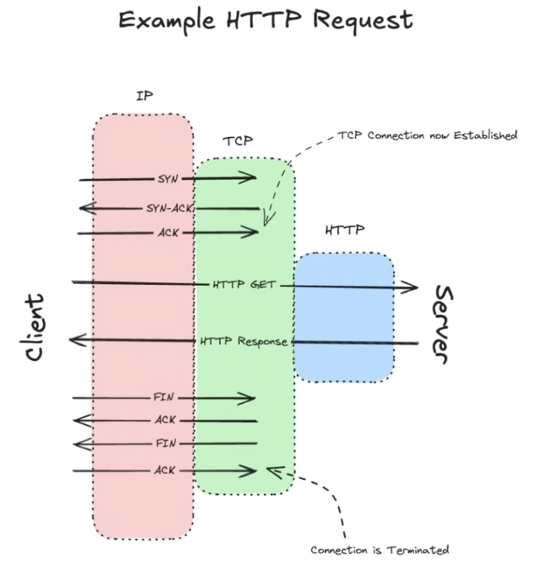

# Network essentials

https://www.youtube.com/watch?v=SHkbPm1Wrno

## OSI Model

- Think of network as a layered cake

| layers | name         | description                                                                 | Example                           |
| ------ | ------------ | --------------------------------------------------------------------------- | --------------------------------- |
| l7     | application  | Interface where user interacts with the network                             | HTTP, DNS, SMTP, FTP              |
| l6     | presentation | Handles data encryption, compression, and formatting                        | SSL/TLS, JPEG, GIF                |
| l5     | session      | Manages the "conversation" (opening/closing/restarting) between two devices | NetBIOS, RPC, Sockets             |
| l4     | transport    | Handles the delivery and error-checking of data packets                     | TCP, UDP                          |
| l3     | network      | Determines the best physical path for data to travel                        | IP, Routers, ICMP                 |
| l2     | data link    | Transfer data between connected nodes on the network                        | Ethernet, Mac addreses, switchers |
| l1     | physical     | Hardware, cables, electrical signals                                        | Fiber, Wifi                       |



- There's a lot of back and forth between layers

### Layer 3: Network Layer (Internet Protocol)

- IP: Giving "names" to nodes in the network and allow routing
  - IPv4: 4 bytes
    - normally used externally
  - IPv6: 16 bytes
    - more used internally

- They come in two flavors:
  - Private: protected from the world
    - Used in: microservices, internal config/hosts
    - If we're going to load balance them, we need to keep track of their existence
  - Public: known to the world
    - assigned by a "central body"
    - routers are aware of them
    - Used in: API gateways, load balancers [externally facing components of your design]

### Layer 4: Transport (Protocols TCP, UDP)

- TCP: default, reliable | snipper
  - slower, but safer
  - guarantee delivery + ordering
  - connection-oriented
  - higher latency
  - we care about individual packages
  - best for: most of content online
- UDP: faster, non-reliable | machine gun
  - faster, but less reliable
  - no delivery guarantee
  - we don't care that much about individual packages
  - where latency is the most important
  - not supported by browsers by default
  - best for: streaming, video conferencing, multiplayer games

### Layer 7: Application layer (HTTP)

#### HTTP

- Formatted requests and responses

Request

```json
GET /posts/1 HTTP/1.1 // method/verb
//headers
Host: thedestination.com
Accept: application/json
User-Agent: the device making the request
```

Response

```json
HTTP/1.1 200 OK // status code
// response headers
Date:
Content-Type:
Content-Length:

// response body
{
  "userId": 1,
  "title": "Some content"
  //...
}
```
