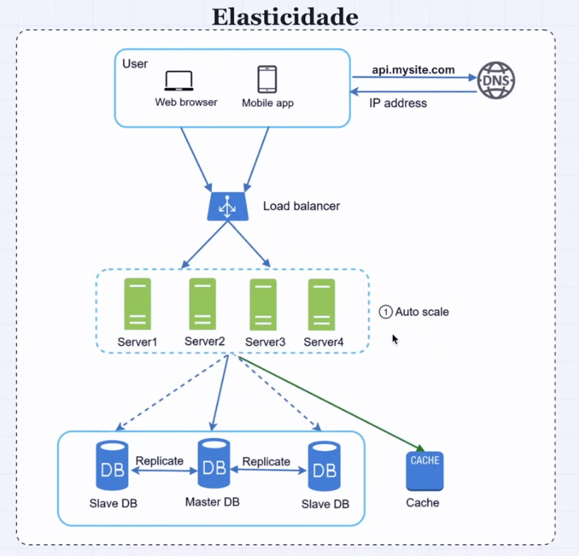
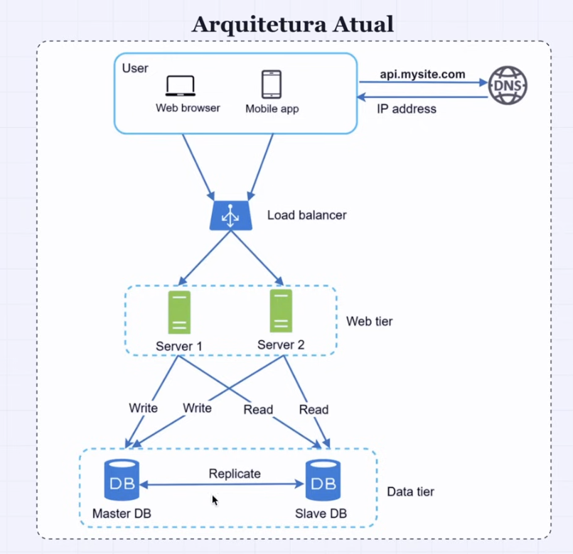

# Scaling software architecture

- A common discussion scenario is an application that started having the need to deal with a increased load of users and this caused the application to be slow or have downtime during peak time

- The objective is not only to write code, but know how to deal with an application in the real-world

## Initial architecture

- Client
  - Web browser
  - Mobile app

- client : DNS
  - api.mysite.com [client -> dns]
  - 12.123.12.123 [dns -> client]

- client : server (the db is deployed here as well)
  - 12.123.12.123 [client -> server]
  - JSON response [server -> client]

- We'll present the solutions below, then "add" on top of each other, not necessarily replace one another. We go to the next level according to the need of that given application. On each solution, we'll see what it does, what it solves and issues that it introduces

### Solution 1: Separate the application server from the db server

- A server for the API
- A server for the DB

- Server -> db [read/write/update]
- Db -> server [return data]

#### Issues with this implementation

- Single point of failure: either from api server or from db
- Solution: scalability
  - Vertical: not much to talk about, you just increase computing power
    - CPU, RAM, Disk, etc
    - It's not bad, however, if we want to achieve 1M users, it's not enough
  - Horizontal: where the magic is. Adding more servers
    - Load balancer

- Failover: if a server fails, we've got one to substitute it
  - Having redudance

## Solution 2: Horizontal scaling

- Needs load balancer: it's the tool that allows switching servers
  - server a
  - server b: a replica of server a

```
        load balancer // receives the requests from the frontend
        /           \ // private ip: not exposed to the internet
    server a        server b
```

### Load balancer

- It's the load balancer that receives the frontend requests and distributes to the server
- With a load balancer, we don't expose our servers to the internet any longer, instead, we expose the load balancer
- What's accessible through the internet is the load balancer, not the servers anymore

Check: 01_load_balancer_nginx.md

#### Auto scaling

- Also, by having multiple servers, the question is, how will these servers be provisioned?
  - manual or automatic provision?
  - if the load increases, how will we add more servers?
  - if the load decreses, how will we reduce the servers?
    - auto scale

- You pay for what you use



### Issues with this implementation

- If we scale the api servers horizontally, we have replicas for our application servers, however, our db server is is one server. Then, we still have the single point of failure issue
- The issue then is that we'll have multiple api server instances connecting to the same db
- If something happens with this single db server, we're screwed

## Solution 3: Database replication

### Master / slave

- The web servers communicate with different db servers
- Web servers -> write to -> master db
- Web servers -> read from -> slave db1, db2...

- Writing [insert/update/delete] is redirected to the master db
- Reading [select] happens in the slave dbs
- In most applications, the volume of reading is much bigger than writing
  - read-only copies

> Check 02_db_replication_master_slave.md



- As we start having more dbs, we need to think about consistency
- Eventual consistency
- Strong consistency
- Weak consistency

### Issues with this implementation

- Consistency can be an issue. We need to identify how we want this consistency: eventual, strong, weak
- More complex setup

## Solution 4: Caching layer

Web server -> Cache -> DB

- If data exists in cache, read from cache
- If data doesn't exist in cache, read from db and save to cache
- Return data to the web server
- Cache runs on the RAM memory

## Solution 5: Data centers

- One common issue is the single point of failure. So, even though we have multiple api and db servers, if they are located in the same region [same data center], we're still exposed to a single point of failure
- We add stuff to our architecture to solve some problems, but by doing that we add problems of a different nature or of a similar nature, but in a different scale. There's always trade offs

- Replication of data across different data centers isn't an insignificant task

### Message brokers


## To sum up: Scaling an application

1. separating application log [api] from db
2. horizontal scaling
   - having replicas
   - these replicas are accessed through a load balancer
   - resolves:
   - single point of failure
     - we have redundance | we add failover
3. database replication
   - master/slave
     - master: write operations [insert/update/delete]
     - slave: read operation [select]
     - most web-apps are read-heavy
   - introduces consistency reflections
4. caching layer
