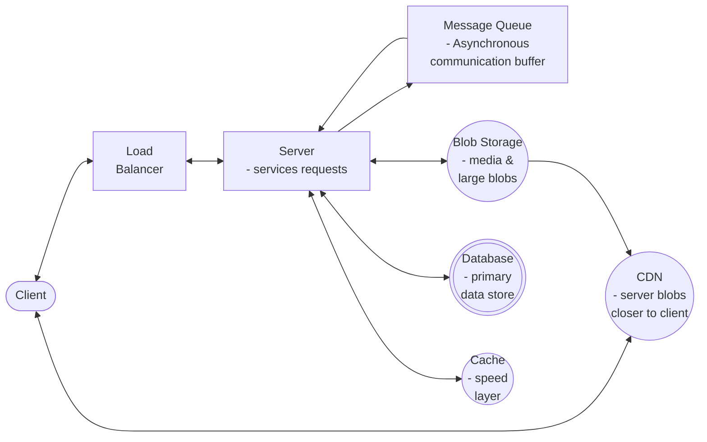

# System Design Overview

- Focus is to architect complex, scalable systems that solve real-world problems
- Think about what services and interactions are necessary to pull off designing the system (based on the requirements)
- You might need to think about:
  - Product design: customer facing products (uber, netflix, youtube, etc)
  - Infrastructure non-customer facing products (data processing pipelines, message queue, etc)

## Framework

1. Requirements

- Define the boundaries
- Functional vs. non-functional requirements
  - what and how it does respectively
  - functional: features of the system

2. Core entities

- The nouns of the system
- Primary entities/objects that will be stored and their properties
- Think about how they relate

3. API or interfaces

- Entry points: REST, GraphQL, gRPC
- Tradeoffs
  - REST: standard
  - gRPC: good for internal microservice communication (faster/smaller payload)
  - GraphQL: good when the client needs to "shape" the request

4. Data flow

- How data flows from the API to storage and back
- Path of the request
- Is there a...
  - load balancer?
  - cache?

- Is the pipe read or write-heavy?

5. High-level design -> functional requirements

- A general view that allows the functional requirements to be attended
- Major components and how they connect
- How the infra looks like
  - load balancers
  - CDN
  - Databases
  - caching

6. Deep dives -> non-functional requirements

- How we attend the non-functional requirements
- Some areas the system might break
  - Scalability?
    - how do we handle a "celebrity" with 100M followers posting a tweet? (thundering herd)
  - Storage?
    - should we focus on read or write optimizations?
    - should we use an index?
    - should we use a cache? where?
  - Availability?
    - how do deal with server failure?

## Portions

1. Problem-solving: identify & prioritize the core challenges
2. Solution design: create scalable architectures with balanced trade-offs
3. Technical depth: deep knowledge and analysis capacity for real-world problems
4. Communication: being able to explain complex topics simply

## Fundamentals

1. Storage

How you query the data and how it grows

- Different storage models: relational, document, key-value, graph

- Relational
  - structured data
  - strict schema
  - tables with columns and rows

- Document
  - json/object-like
  - flexible
  - scales horizontally easier than relational

- Key-value: redis
  - Simple dictionary
  - great for caching

- Graph:
  - focuses on relationships
  - used in fraud detection

- ACID vs BASE
  - Atomicity
  - Consistency
  - Isolation
  - Durability

  - Basically Available Soft state Eventually consistent

- ACID: consistency > availability
  - ACID = safety-first
  - If one part of the transaction fails, the whole thing is erased

- BASE: availability > consistency
  - Speed/scale first
  - System can get out of sync, but it catches up

2. Scalability: how we scale the system so we can support increased load?

- vertical vs. horizontal scaling
- storage scale
  - partitioning & sharding

3. Networking

- OSI layers
  - application layer:
    - API design
      - HTTP protocols
      - REST vs GraphQL vs. gRPC
    - DNS resolution
    - Websockets
  - transport layer:
    - TCP vs UDP
    - request response lifecycle
  - network layer:
    - firewalls, ACLs
    - load balancing

4. Latency, throughput & performance

- What's the latency for common operations?
  - RAM: 100ns
  - SSD: .1 - .2ms
  - HDD: 1-2ms

- What's the latency for data exchange?
  - same region: 1-10ms
  - cross region: 50ms

5. Fault tolerance & redundancy

- Failures are inevitable in distributed systems
- Replication strategies
- Failure detection mechanisms

6. CAP Theorem

- Partition tolerance is a guarantee
  - means: the capacity of a system to continue working when nodes become disconnected
  - network issues are inevitable, so partition tolerance usually means choosing C or A
- Consistency, Availability, Partition tolerance
  - Network fails on data exchange. What to do?
    - STOP serving data (consistency): CP
      - if nodes can't communicate, return error and refuse to provide outdated data
    - RISK wrong data (availability): CA
      - nodes continue sending data, even if they can't sync with others

## Components



```
CDN Server    <---------------   blob storage
    |                              /
Client -> Load balancer -> Server -> Database
                             |     \
                    message queue   cache
```

- Database: long-term memory
  - where the data lives when the power goes off
  - The real question is SQL or NoSQL, but how does you app need to read and write data?

- cache: short-term memory
  - redis
  - store frequently accessed data
  - faster
  - how long does info stay valid? when do you "update" the cache?
  - increases speed of reading, but adds complexity

- message queues: async operations for computationally expensive operations
  - kafka, rabbitmq
  - texting, instead of calling
  - you don't need both sides working at the same time. async communication

- load balancers: traffic control
  - take incoming requests and direct them to different servers
  - no single machine gets overwhelmed
  - which server should get the next request?

- blob storage: large files storage
  - s3
  - db is used to save structured/text (mainly) information
  - structured data => db
  - unstructed/large data => blob storage
  - large files (images/videos) should live on a blob storage

- CDN: it's just a cache
  - server blobs close to client
  - cloudflare
  - they host the content (most of the times from the blob storage) close to the user

## Problems

A good order to approach them is:

1. bitly
2. dropbox
3. ticketmaster
4. news feed
5. whatsapp
6. leetcode
7. uber
8. web crawler
9. ad click aggregator
10. post search
