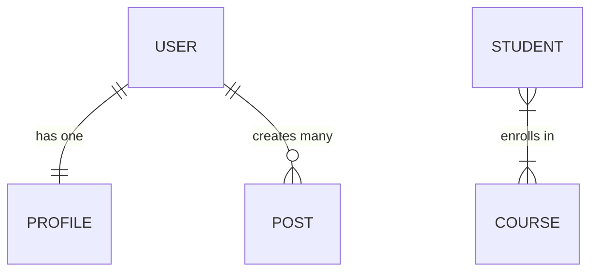

# Data Modeling

Data model defines how the data is:

- structured: what entities exist?
- stored: how you find them?
- related: how do they connect one to another?

## System design thinking

Hello interview delivery framework

1. Requirements
   - Functional requirements
   - Non functonal requirements
2. Core entities
3. API or Interface
4. Data flow
5. High-level design
6. Deep dives

## Database model options

1. Relational db: usually the best choice
   - Postgres
2. Document db
   - Choose this only if you want to support schema flexibility
3. Key-value store: redis, dynamodb
   - Similar to a big hash table
   - Useful for cache that sits in front of the db
   - Data needs to be duplicated for many different functionalities
4. Wide-column databases
   - great for where there's a ton of write volume (sensors, logs)
5. Graph db
   - data is stored as nodes and edges
   - avoid using it in the system talks

## Schema design

Three key factors:

- They should have been clarified in the requirements gathering or in the API design

1. Data volume: where can data live? (single db vs. distributed)
   - where the data physically lives
   - can the data be centered in one region or distributed?
2. Access patterns: how is the data queried? (drives indexes vs. structure)
   - how the data is queried
   - cached vs non-cached
3. Consistency requirements: how strict? (ACID vs eventual consistency)
   - strong consistency: financial transactions
   - weak consistency: a blog

### Entities, Key & Relationships

- Primary key (pk): unique identifier for each record in a table
  - no other record can have one similar
- Foreign key (fk): points to a pk in another table to create a relationship

```
// ex: we're designing something analagous to IG

Users
- userId (pk): string
- email: string (unique)
- createdAt: Date
- name: string

Posts
- postId (pk)
- userId (fk) // 1 to N => one user can have multiple posts, but a post can have only one user
- contentType
- mediaUrl

Comments
- commentId (pk)
- userId (fk)
- postId (pk)
- content
```

- Define fk clearly then the relationship gets clearer. Don't get bogged down by explaining 1 to N or N to N

#### Relationship Types

Understanding how entities connect is crucial for schema design.



1.  **One-to-One (1:1)**:
    - Each record in Table A relates to exactly one record in Table B.
    - _Example_: A `User` has exactly one `Profile`.
2.  **One-to-Many (1:N)**:
    - A record in Table A can relate to many records in Table B, but Table B records relate to only one in Table A.
    - _Example_: One `User` can author many `Posts`.
3.  **Many-to-Many (M:N)**:
    - Multiple records in Table A relate to multiple records in Table B.
    - _Implementation_: Usually requires a "junction" or "join" table.
    - _Example_: Many `Students` can enroll in many `Courses`.

#### Normalization vs. Denormalization

- Normalization: information is stored in only one place
  - No data duplication
  - Data is consistent, but it requires `JOIN`
  - write cheap, read expensive
- Denormalization: duplicating information across tables
  - Usually done for performance
  - increase writing, reduces reads (data is located where needed, without further computation)
  - only denormalize, if any other strategy for improving performance can't be met
    - indexing
  - if you need to denormalize it, put it in the cache

### Indexing for Access Patterns

- The first thing you do if you need to make data access faster, it's adding `indexing`
- Indexing: creating data structures that help the db find data more quickly
  - Add indexes to support the most common queries

### Scaling and sharding

- When the data doesn't fit or it was decided to distribute it, for security/availability reasons, sharding is the solution
  - what's the right strategy to keep related data together?
  - always keep related data together

```
         shard 1 posts 0 - 10k
      /
server -  shard 2 posts 10k - 20k
      \
         shard 3 posts 20k - 30k
```

<!-- 27:35 -->
<!-- https://www.youtube.com/watch?v=TUcPS6dsWx4 -->
